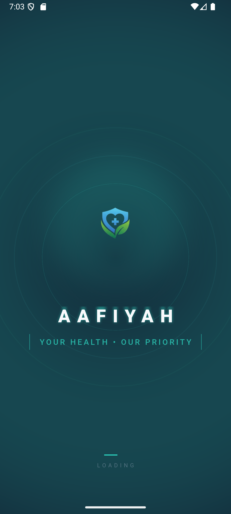
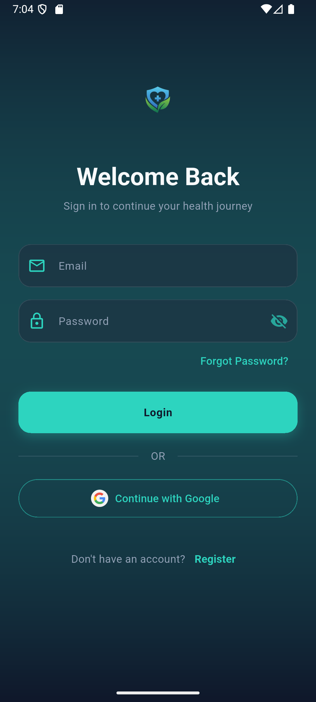
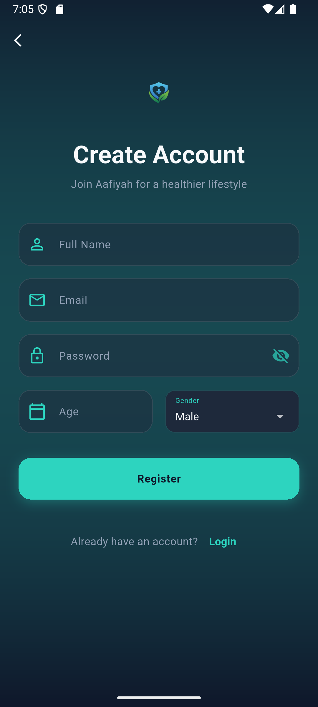
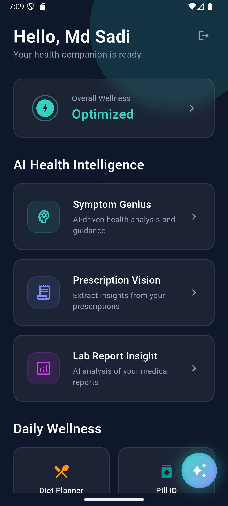
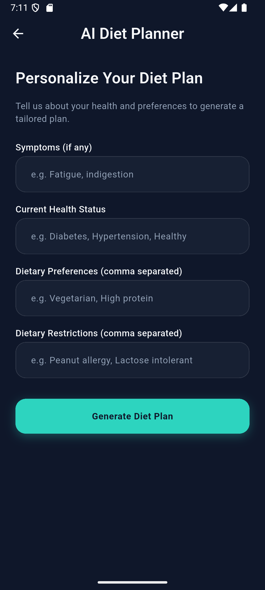

# Aafiyah - AI-Powered Personal Health Companion 🏥✨

**Aafiyah** is a comprehensive, state-of-the-art health management ecosystem built with Flutter. It leverages advanced Artificial Intelligence to provide users with actionable health insights, automated document analysis, and proactive wellness management.

---

## 📸 App Showcase

### Core Experience
| Splash Screen | Login | Registration | Home Dashboard |
| :---: | :---: | :---: | :---: |
|  |  |  |  |

### AI-Driven Health Intelligence
| Aafi AI Assistant | Pill Identifier | Lab Report Analysis | Symptom Checker |
| :---: | :---: | :---: | :---: |
|  |  |  |  |

### Document & Data Insight

| Prescription Analysis | Blood Pressure Record | Critical Alerts | Wearable Integration |
| :---: | :---: | :---: | :---: |
|  |  |  |  |

### Lifestyle & Motivation

| Diet Planning | Health Advice | Medicine Reminder | Rewards & Streaks |
| :---: | :---: | :---: | :---: |
|  |  |  |  |

## 🚀 Key Features

- **🤖 Aafi AI (Gemini Powered):** A personalized AI companion for health queries, symptom checking, and emotional support.
- **🔍 Pill Identifier:** Snap a photo to identify medications and understand their usage and side effects.
- **📄 Lab Report & Prescription Insight:** Automated analysis of medical documents to simplify complex terminology.
- **⌚ Wearable Integration:** Sync data from HealthKit (iOS) and Google Fit (Android) for real-time monitoring.
- **📊 Advanced Health Tracking:** Monitor Blood Pressure, BMI, Hydration, and Mood patterns with visual analytics.
- **💊 Smart Reminders:** Context-aware notifications for medication adherence and wellness activities.
- **🏥 Telemedicine Suite:** Connect with healthcare providers and manage digital consultations.
- **🏆 Gamification:** Stay motivated with health streaks and achievement rewards.
- **🚨 Critical Alerts:** Real-time monitoring for abnormal health metrics with emergency notification support.

---

## 🛠️ Tech Stack & Architecture

- **Frontend:** [Flutter](https://flutter.dev/) (3.x)
- **Language:** [Dart](https://dart.dev/)
- **AI Core:** [Google Generative AI](https://pub.dev/packages/google_generative_ai) (Gemini)
- **Backend:** [Firebase](https://firebase.google.com/) (Auth, Firestore, Analytics)
- **State Management:** [Provider](https://pub.dev/packages/provider)
- **Local Storage:** Shared Preferences
- **Health Data:** Health & Google Fit APIs
- **Geographic Services:** Geolocator (for local healthcare facilities)

---

## ⚙️ Installation & Setup

### Prerequisites
- [Flutter SDK](https://docs.flutter.dev/get-started/install)
- [Firebase Account](https://console.firebase.google.com/)
- [Gemini API Key](https://aistudio.google.com/)

### Steps
1. **Clone the repository:**
   ```bash
   git clone https://github.com/MdKhanBahadurSadi/Aafiyah.git
   cd aafiyah
   ```
2. **Install dependencies:**
   ```bash
   flutter pub get
   ```
3. **Configure Firebase:**
   - Add your `google-services.json` (Android) and `GoogleService-Info.plist` (iOS).
4. **Environment Variables:**
   - Configure your Gemini API key in `lib/core/constants/app_config.dart`.
5. **Run the application:**
   ```bash
   flutter run
   ```

---

## 📄 License

Distributed under the MIT License. See `LICENSE` for more information.

---

## 🤝 Contributing

Contributions are welcome! Please feel free to submit a Pull Request.

---

**Aafiyah** — Your Health, Your Wealth. 💚
